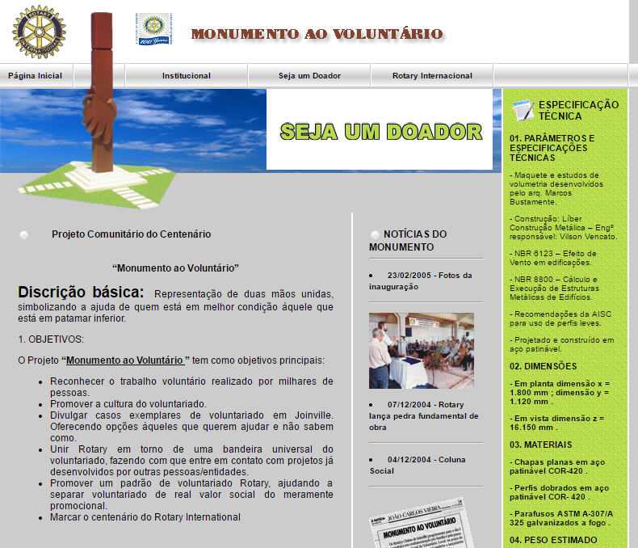

<!-- BACK TO TOP ANCHOR -->

<!-- LOGO -->

  

  <h1 align="center">Monumento ao Voluntário Rotary Club</h1>

  
A dynamic PHP campaign site built in 2004 to drive corporate sponsorships and community support for the construction of a 16.2-meter steel volunteer monument in Joinville, Brazil, moving the Rotary Club project from fundraising to inauguration in under three months.

  
// civic campaign · Rotary Club Joinville

   

  <a href="https://webarchive.leonardolimadevasconcellos.workers.dev/monumento-ao-voluntario"><strong>View it live »</strong></a>

 

<!-- SHIELDS -->

[![Creator Website][website-shield]][website-url]
[![Contributors][contributors-shield]][contributors-url]
[![Forks][forks-shield]][forks-url]
[![Issues][issues-shield]][issues-url]
[![LinkedIn][linkedin-shield]][linkedin-url]
[![Released][year-shield]][year-url]

<!-- TABLE OF CONTENTS -->

  
Table of Contents

  <ol>
    <li><a href="#about-the-project">About The Project</a></li>
    <li><a href="#screenshots">Screenshots</a></li>
    <li><a href="#built-with">Built With</a></li>
    <li><a href="#roadmap">Roadmap</a></li>
    <li><a href="#contributors">Contributors</a></li>
    <li><a href="#contact">Contact</a></li>
  </ol>

<!-- ABOUT THE PROJECT -->
## About The Project

[![Product Screenshot][product-screenshot]](https://leonardo-vasconcellos.vercel.app/portfolio/monumento-ao-voluntario)

<!-- PROJECT INTRO: 260 chars max -->

A dynamic PHP campaign site built in 2004 to drive corporate sponsorships and community support for a 16.2-meter steel volunteer monument in Joinville, Brazil — from fundraising to inauguration in under three months.

<!-- END INTRO -->

The Rotary Clubs of Joinville commissioned this site in late 2004 to support their centennial community project: erecting a 16.2-meter COR-420 patinated-steel monument in the Arena Joinville square as a permanent tribute to volunteerism and a marker of Rotary International's 100th anniversary (February 23, 2005).

Built by Leonardo Vasconcellos (UDESC) and Sandro Marcos da Silva (Hannover Info), the site launched alongside the campaign's public kick-off in November 2004 and served as the project's primary digital presence through the monument's inauguration just three months later.

**Key features:**

<!-- KEY FEATURES -->
### Key Features

- **Self-service news system** — a dynamic news module that let the Rotary team publish dated milestone updates — press clippings, cornerstone ceremony, inauguration photos — without touching code, keeping donors and the public informed throughout the campaign
- **Sponsor acquisition page** — a formal donor pitch with named recognition on the monument plaque, directly supporting the ~R$120,000 fundraising goal that brought corporate partners (Engepasa, Vega do Sul) and the municipal government on board
- **Animated campaign banner** — a Flash banner with a cookie-based repeat-visit flag, an early personalization mechanic that gave the campaign a polished presence while controlling the experience on return visits

The site is a PHP application with shared template functions rendering header, navigation, and footer consistently across pages. The horizontal JavaScript navigation menu used image-based backgrounds and mouseover events for institutional sub-menus.

**Sections:** The homepage presented project objectives, a sidebar news feed, and the monument's full engineering specs (materials, dimensions, weight, finish). The news section preserved five dated articles — including press clippings from *A Notícia* newspaper — documenting milestones from announcement to inauguration. The sponsor page delivered a formal corporate pitch letter with naming rights on the monument plaque.

**Outcome:** The campaign raised approximately R$120,000 from corporate partners (Engepasa, Vega do Sul), the Municipal Government, and the State Government of Santa Catarina, enabling the 7-ton structure to be built and inaugurated on schedule.

**Preservation:** The Flash inauguration animation was later restored using Ruffle.rs (WebAssembly Flash player), ensuring the archive remains fully functional in modern browsers.

(<a href="#readme-top">back to top</a>)

<!-- SCREENSHOTS -->
## Screenshots

  
  
  

(<a href="#readme-top">back to top</a>)

<!-- BUILT WITH -->
## Built With

<!-- LANGUAGES -->

**Languages**

|  | Language | Version |
|---|---|---|
|  | JavaScript | ES3 |
|  | HTML | 5 |
|  | CSS | 3 |
|  | PHP | 4.x |

(<a href="#readme-top">back to top</a>)

<!-- ROADMAP -->
## Roadmap

This project repository is for archive purposes only. No new features or issues are being tracked.

(<a href="#readme-top">back to top</a>)

<!-- CONTRIBUTORS -->
## Contributors

(<a href="#readme-top">back to top</a>)

<!-- CONTACT -->
## Contact

[Leonardo Vasconcellos - Website](https://leonardo-vasconcellos.vercel.app/) — [LinkedIn](https://www.linkedin.com/in/llvasconcellos)

(<a href="#readme-top">back to top</a>)

<!-- MARKDOWN LINKS & IMAGES -->

[website-shield]: https://img.shields.io/badge/Creator_Website-%E2%86%97-2eba7a?style=for-the-badge
[website-url]: https://leonardo-vasconcellos.vercel.app/
[contributors-shield]: https://img.shields.io/github/contributors/llvasconcellos2/monumento-ao-voluntario.svg?style=for-the-badge
[contributors-url]: https://github.com/llvasconcellos2/monumento-ao-voluntario/graphs/contributors
[forks-shield]: https://img.shields.io/github/forks/llvasconcellos2/monumento-ao-voluntario.svg?style=for-the-badge
[forks-url]: https://github.com/llvasconcellos2/monumento-ao-voluntario/network/members
[issues-shield]: https://img.shields.io/github/issues/llvasconcellos2/monumento-ao-voluntario.svg?style=for-the-badge
[issues-url]: https://github.com/llvasconcellos2/monumento-ao-voluntario/issues
[linkedin-shield]: https://img.shields.io/badge/-LinkedIn-0A66C2?style=for-the-badge&logo=linkedin&logoColor=white
[linkedin-url]: https://www.linkedin.com/in/llvasconcellos
[year-shield]: https://img.shields.io/badge/Released-2004-gray?style=for-the-badge
[year-url]: #
[product-screenshot]: <screenshots/Monumento ao Voluntário.png>
